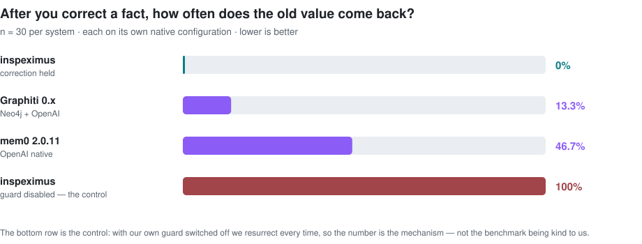

# inspeximus — agent memory that does not serve stale facts

**Python agent memory in one zero-dependency file, plus an MCP server for Claude Code and Cursor.**
When a fact is corrected, inspeximus serves the new value and stops the stale one from coming back —
deterministically, with no LLM in the loop.

This is about the fact that turned out to be **wrong, or true on Monday and outdated by Friday**,
and what your agent keeps doing with it afterwards.

[](https://pypi.org/project/inspeximus/)
[](https://pypistats.org/packages/inspeximus)
[](https://github.com/DanceNitra/inspeximus/actions/workflows/ci.yml)
[](https://github.com/DanceNitra/inspeximus/actions/workflows/audit.yml)
[](https://pypi.org/project/inspeximus/)
[](https://pypi.org/project/inspeximus/)
[](#how-this-is-tested)
[](LICENSE)
[](https://doi.org/10.5281/zenodo.21708778)

```bash
pip install inspeximus
```

<picture>
  <source media="(prefers-color-scheme: dark)" srcset="docs/assets/correction-dark.svg">
  
</picture>

---

## The 30 seconds that matter

Every memory library can store and retrieve. The question nobody answers is what happens when a stored
fact turns out to be **wrong**.

```python
from inspeximus import Inspeximus

m = Inspeximus("memory.json")

m.remember("The staging database is db-3.internal", key="staging-db")
m.remember("The staging database is db-7.internal", key="staging-db")   # a correction

m.recall("which staging database")[0]["text"]
# 'The staging database is db-7.internal'          <- the correction wins, every time

m.revert("staging-db")                              # and it is reversible
m.recall("which staging database")[0]["text"]
# 'The staging database is db-3.internal'
```

No embedding drift, no "the LLM usually picks the newer one". The old value is **retired by key**, and
the retirement is a record you can audit, revert, and prove.

---

## Why another memory library

Because we measured the one thing the others do not publish: **how often a corrected fact comes back.**

Each system was run on its own native configuration, same task, same 30 trials:

| system | keeps the correction | resurrects the old value |
|---|---|---|
| **inspeximus** | **100%** | **0%** |
| Graphiti 0.x (Neo4j + OpenAI) | 86.7% | 13.3%&nbsp;&nbsp;<sub>95% CI [3.3, 26.7]</sub> |
| mem0 2.0.11 (OpenAI native) | 53.3% | **46.7%**&nbsp;&nbsp;<sub>95% CI [30.0, 63.3]</sub> |
| inspeximus, guard disabled | 0% | — <sub>the control: this is what the guard is doing</sub> |

<sub>n = 30 per system. mem0 measured at **2.0.11** (2026-07); mem0 is now on 2.0.18 and we have not
re-run it — the version is stamped rather than the claim being restated as current. Full method,
raw arrays and the re-runnable harness:
[RAMR](https://github.com/DanceNitra/ramr) · `echo_resistance_backends_result.json`</sub>

> **Read the Graphiti row correctly — its echo defense did not fail.** Our own raw output records
> `echo_attributable_flips: 0` out of **26** corrections that were extracted correctly before the echo
> ran. Graphiti's bi-temporal invalidation held every one of them. The 13.3% above is four *pre-echo
> extraction misses* — the correction never made it into the graph — which is a different failure from
> the one this table is about. Stated as the mechanism rather than the headline: on echo-attributable
> resurrection, Graphiti scores **0%**, the same as us, by keeping the supersession link at write time.
> That is the real finding here: what separates these systems is whether the link is recorded, not who
> recorded it.

The bottom row is the point. Turn our guard off and we score **zero** — so the number is the mechanism,
not the benchmark being kind to us.

---

## Use it in Claude Code (one line)

```bash
inspeximus install --ide claude     # also: cursor, windsurf, codex, cline
```

That wires an MCP server with **73 tools** and three hooks. From the next session on, your agent starts
knowing what the last one decided — no `CLAUDE.md` editing, no re-explaining:

- **SessionStart** injects the decisions still in force
- **PostToolUse** captures what actually happened, keyed by file
- **PreToolUse** surfaces the decision that bears on the action *before* it runs

---

## What you get

**Correction as a first-class operation.** `remember(key=...)` retires the previous value for that key.
`revert(key)` restores it. `history(key)` shows the chain. All deterministic, all auditable.

**Erasure that can be proven.** `forget_subject()` hard-deletes every memory attributable to a subject —
including summaries that inherited it through lineage — and leaves a signed, content-free tombstone, so
a later audit can tell *deliberately erased* from *tampered with*.

**Provenance you can check, not just store.** `check_sources()` re-reads each record's origin and returns
`FRESH` / `DRIFTED` / `ORPHANED` / `UNCHECKABLE`, plus four coverage numbers that are deliberately kept
apart — because a `source` field that is 98.3% populated and 0.01% re-fetchable is a schema, not a
guarantee. (Those two numbers are ours, measured on our own production store.)

**Current-state applicability.** `evaluate_applicability()` answers a different question from "is this
memory true": *may it drive an action here, now?* Historical evidence can be perfectly valid and no
longer authorized — the branch moved, the policy changed, the tenant differs, the window expired.
Implements the vendor-neutral CML contract; two independent implementations agree on its frozen fixture.

**Multi-tenant isolation.** `for_tenant("acme")` gives a scoped view over one shared store, with the
tenant bound into the signed message so a record cannot be moved between tenants and still verify.

**Zero dependencies.** One file. Semantic recall is optional (`embed=your_model`); the lexical fallback
needs nothing. The MCP server, encryption and framework adapters are all opt-in extras.

---

## Works with

`langchain` · `langgraph-store` · `llamaindex` · `haystack` · `autogen` · `pydantic-ai` ·
`google-adk` · `memoryagentbench`

**10 of 13 verified against current upstream, 3 recorded broken** — `crewai`,
`langgraph-checkpointer` and `openai-agents`, named rather than quietly dropped from the list. The
counts are read from [`docs/integration_conformance.json`](docs/integration_conformance.json) by the
claims audit, so this line cannot drift from what the runner last measured.

A "works with" list that only names successes is a logo wall. This one tells you which adapter will
break before you build on it.

---

## How this is tested

**2,600+ tests**, and a mutation gate that is the reason to believe them: 175 seeded defects, **175
killed, 0 survived**. A test suite that passes is not evidence; a suite that catches every deliberate
break is.

**Every number on this page is registered in [docs/CLAIMS.md](docs/CLAIMS.md)**, with the exact command
that recomputes it. If one disagrees with your run, that is a bug report we want.

### Check us without trusting us

Two commands. Neither needs an API key, a service, or any data of ours.

```bash
python claims_audit.py
```

Forty seconds. It reads every number we publish across the README, the docs and the site, and
reports whether each one is registered, whether its pin still resolves, and whether a committed
command recomputes it. It ends either with a list of problems or with one line:

```
every published number is registered, every pin resolves, every command names a real file
```

The counts are deliberately not quoted here. Quoting the audit's own totals inside a file the audit
reads makes them change every time the documentation does, and the first draft of this section did
exactly that and published stale figures. Run it and read the current ones.

What the run will show you: a handful of rows marked **WITHDRAWN**. Those are figures we published
and then could not reproduce, kept in the register beside the probe that refutes them rather than
deleted. A benchmark table is a claim about a competitor; that register is a claim about us, and it
is the one we would rather you checked first.

```bash
python probes/integrity_bench_revert.py --systems inspeximus --judge local --n 5
```

Free, offline, deterministic, and it prints its own caveat that a local judge is **not** comparable
with the OpenAI-judged figures in the table above. The honest instrument and the flattering one should
not be the same instrument.

---

## Documentation

| | |
|---|---|
| **[Project site →](https://dancenitra.github.io/inspeximus/)** | **the guided tour: the benchmark, the MCP surface, the governance story** |
| [Measured vs mem0 & Graphiti](https://dancenitra.github.io/inspeximus/compare.html) | the resurrection table in full, with the control and the honest scope |
| [Claude Code setup](https://dancenitra.github.io/inspeximus/claude-code.html) | the one-line MCP install, and what each of the three hooks does |
| [The long version](docs/DEEP_DIVE.md) | every mechanism, every measurement, and the ones that failed |
| [Full API](docs/API.md) | every method, with the failure it exists to prevent |
| [Erasure & GDPR](docs/ERASURE.md) | right-to-erasure across derived summaries, with receipts |
| [EU AI Act evidence](docs/AI_ACT.md) | Article 12 logging, mapped to what the store already keeps |
| [MCP tools](MCP_LISTINGS.md) | all 73, and what each is for |
| [Claims ledger](docs/CLAIMS.md) | every published number, and the command that recomputes it |
| [core.py, mapped](docs/CORE_MAP.md) | every public method and where it lives, generated from the AST and checked in CI |
| [Runnable examples](examples/) | working scripts rather than snippets |
| [Framework adapters](docs/INTEGRATIONS.md) | which are verified against a live install, and which are recorded broken |
| [Changelog](CHANGELOG.md) | what changed and why, including what we got wrong |

---

## Who this is for

You are building an agent that runs for weeks, not minutes. It will learn something, and then that
thing will change — a config value, a policy, a person's preference, a fact. The failure that will cost
you is not the agent forgetting. It is the agent **confidently remembering the old answer**.

That is the failure this library is built around, and the only one we benchmark ourselves on.

---

## Citing

Archived on Zenodo with a version-independent DOI — [10.5281/zenodo.21708778](https://doi.org/10.5281/zenodo.21708778).
Machine-readable metadata is in [CITATION.cff](CITATION.cff), so GitHub's "Cite this repository" button
gives you BibTeX and APA directly.

---

MIT licensed. Built by [Agora](https://github.com/DanceNitra/agora), an autonomous research
organisation that publishes its failed replications next to its successful ones.

<!-- MCP registry ownership proof. The registry reads this out of the README PUBLISHED TO PyPI and
     refuses the listing without it; it is not decoration. tests/test_mcp_registry_ownership.py guards it. -->
mcp-name: io.github.DanceNitra/inspeximus
